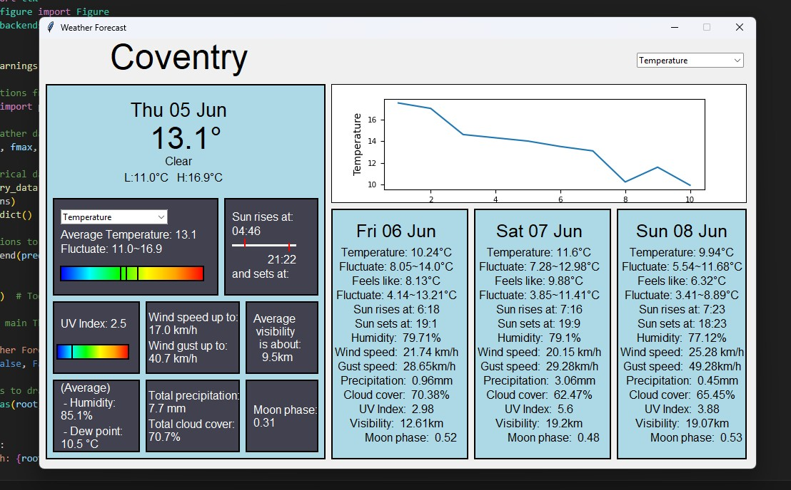
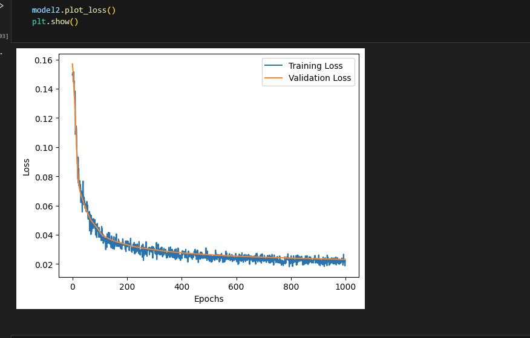
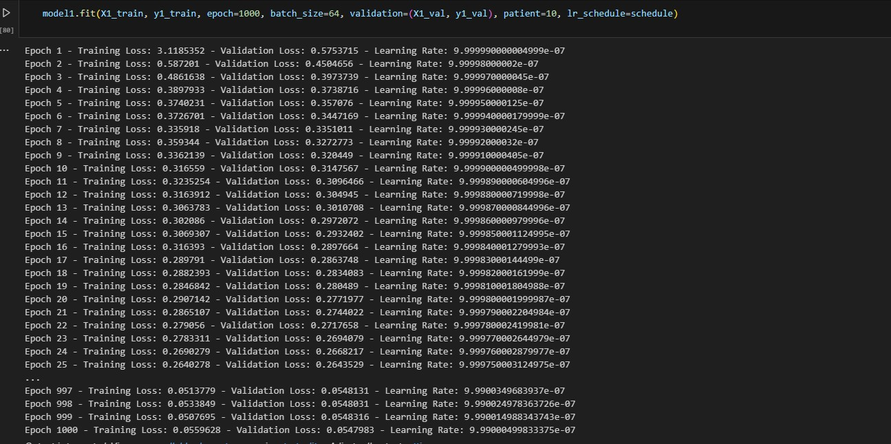

# Weather Forecast Application (WFA)

A simple weather forecasting app for Coventry, UK demonstrating an AI approach built with a neural network implemented from scratch using **NumPy**, without any deep learning frameworks. This project showcases fundamental AI skills, data processing, and GUI development using Python.


<p style="font-style: italic; font-size: small; margin-top: 4px;">
Main window of the Weather Forecast Application, built with Tkinter.
</p>

---

## Features

- Neural network for weather forecasting implemented purely with NumPy (no TensorFlow/PyTorch).  
- Data processing and training using pandas and NumPy.  
- Interactive GUI built with Tkinter for user input and displaying forecast results.  
- Integration with WeatherCrossing API to fetch weather data in real-time.  
- Training process and data handling fully coded in Python and demonstrated in Jupyter Notebook.

---

## Technologies Used

- **Python 3**  
- **NumPy** for numerical computations  
- **Pandas** for data processing  
- **Tkinter** for GUI development  
- **Requests** or similar for API calls (WeatherCrossing)  
- Jupyter Notebook for development and experimentation  

---

## Installation & Setup

This project is primarily an archived learning experiment and not optimized for easy setup or deployment. However, if you want to run it locally, here are the general steps:

1. **Requirements:**  
   - Python 3.x installed  
   - Install dependencies:  
     ```bash
     pip install numpy pandas matplotlib requests
     ```
2. **API Key:**  
   - Obtain a WeatherCrossing API key (you will need to replace the placeholder in the code with your key).  
3. **Running the App:**  
   - Run the main Python script to launch the Tkinter GUI:  
     ```bash
     python main.py
     ```
4. **Training:**  
   - All the neural network/data processing utilities are stored in the models/tools file respectively, with test in them (you'd have to install **tensorflow** and **sklearn** to test those)
   - Training and data processing code is available in the Jupyter Notebook files (`.ipynb`), which can be run to retrain (you'd have to install **jupyter notebook** to run the test, or pull the last commit to get the trained version)

      ```bash
     pip install tensorflow scikit-learn notebook
     ```


---

## Usage

- The app fetches weather data and uses the neural network to forecast weather conditions in Coventry.  
- Training can be run separately in the notebook to update the model with new data.

---

## Project Structure

/WeatherForecast/ <br>
├── main.py # Main Tkinter GUI application <br>
├── train.ipynb # Jupyter Notebook with training code <br>
├── data/ # Folder containing datasets (if any) <br>
├── models/ # Implementation of neural network <br>
├── tools/ # Implementtation of data processing tools <br>
├── save/ #Saved model from the train.ipynb <br>
└── README.md # This file <br>

## Known Issues & Limitations



<p style="font-style: italic; font-size: small; margin-top: 4px;">
Training loss over epochs showing model convergence during neural network training.
</p>



<p style="font-style: italic; font-size: small; margin-top: 4px;">
Visualization of the training process showing epoch progression and model performance metrics.
</p>

- The neural network implementation is educational and not optimized for production.  
- Setup requires manual API key insertion and Python package installation.  
- The training process can be slow and is only demonstrated in notebooks, not fully integrated into the app.  
- The project is a learning archive and may lack error handling or input validation.

---

## License

This project is archived for educational purposes and is provided under the **MIT License**.  
You are free to use, modify, and distribute the code with proper attribution to the original author.

See the [LICENSE](LICENSE) file for full details.

---

## Contact & References

- **Author:** Gia Luong Vu  
- **LinkedIn:** [https://linkedin.com/in/gia-luong-vu-38b04728b](https://linkedin.com/in/gia-luong-vu-38b04728b)  

---

Feel free to explore, learn from, and adapt this project.
